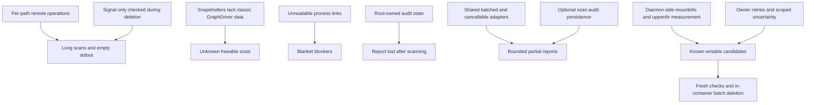

# disk-space-saviour issues 33–40: bounded scans and usable container cleanup

[Parent issue #40](https://github.com/link-foundation/disk-space-saviour/issues/40) requires one PR to address all seven native sub-issues. [PR #41](https://github.com/link-foundation/disk-space-saviour/pull/41) contains the implementation, regressions, release changeset and this analysis.

## Evidence and reconstructed timeline

| UTC time/date                     | Observation                                                                                                                                       | Evidence and qualification                                                                                                                                        |
| --------------------------------- | ------------------------------------------------------------------------------------------------------------------------------------------------- | ----------------------------------------------------------------------------------------------------------------------------------------------------------------- |
| Before 2026-10-09                 | dss 0.14.1 in-container scans took roughly one minute per container                                                                               | Reporter comparison, not a benchmark run here                                                                                                                     |
| 2026-10-09, before issue creation | dss 0.15.0 at 7c23a4a on Ubuntu 24.04, 6 CPUs/11.7 GB, Docker 29.6.1 containerd image store, live restore, five running containers                | Same production setup described in issues 33–37                                                                                                                   |
| 2026-10-09T22:24:11Z              | #33: recursive scan still in second container after 43 minutes; 2,361 readlink execs in one Rust task; output empty; 37,579 trace lines           | [33 source](../issue-33/data/dss-issue.json); original full trace was not attached                                                                                |
| 2026-10-09T22:24:13Z              | #34: timeout 2400 had waited three more minutes without stopping Node; only SIGKILL stopped it                                                    | [34 source](../issue-34/data/dss-issue.json); stopped run lost findings                                                                                           |
| 2026-10-09T22:52:25Z              | #35: GraphDriver null; manual mountinfo/upperdir method found 16.4 and 5.5 GiB safe writable Cargo data                                           | [35 source](../issue-35/data/dss-issue.json); manual cleanup changed one layer 22→15 GB and host free 95→102 GB                                                   |
| 2026-10-09T22:55:24Z              | #36: missing Perlbrew/SDKMAN/nvm/semver/gem rules; Go cache outside hard-coded default                                                            | [36 source](../issue-36/data/dss-issue.json); reporter du measurements                                                                                            |
| 2026-10-09T22:55:27Z              | #37: host npm cleanup stopped after a container claude task exited independently                                                                  | [37 source](../issue-37/data/dss-issue.json)                                                                                                                      |
| 2026-10-10T10:15:02Z              | #38: dss 0.15.2 blocked 159/159 items in nonprivileged root context and 89 safe items in nonroot DinD context                                     | [38 source](../issue-38/data/dss-issue.json); identity-dependent /proc visibility                                                                                 |
| 2026-10-10T10:15:03Z              | #39: root-owned audit state caused user scans to exit EACCES with empty stdout                                                                    | [39 source](../issue-39/data/dss-issue.json)                                                                                                                      |
| 2026-10-10T10:59:22Z              | #40 aggregated all seven issues and required separate closing references                                                                          | [Parent API data](data/dss-issue.json)                                                                                                                            |
| 2026-10-10                        | Read issue descriptions/comments and all three PR comment endpoints, examined recent safety work, wrote failing fixtures and applied shared fixes | Comments were empty; [related PR 28](data/pr-28.json) and [PR 15](data/pr-15.json) are preserved                                                                  |
| 2026-10-10                        | Found an independent Deno Node-compatibility bug during signal validation                                                                         | [Upstream Deno #37001](https://github.com/denoland/deno/issues/37001), [reproduction/body](data/deno-report.md) and [comparison log](data/runtime-exit-codes.log) |

Original available data is copied under each issue’s `data/`: complete API metadata, body, comments and inline code/log excerpts. No screenshots or downloadable log URLs were present. This analysis does not claim the unattached 37,579-line trace was recovered or the reporter’s large host benchmark was repeated. Inherited template case studies with coincident issue numbers are retained separately.

## Every parent requirement

| ID   | Requirement                                                                            | Implementation and completion evidence                                                                                                                                                                             |
| ---- | -------------------------------------------------------------------------------------- | ------------------------------------------------------------------------------------------------------------------------------------------------------------------------------------------------------------------ |
| 40.1 | Read all seven issues and their comments; implement every request                      | Seven source snapshots; functional matrices linked below; targeted regressions and shared adapter changes                                                                                                          |
| 40.2 | One PR, no deferred listed issue                                                       | All implementation stays on issue-40-bcb1f5ac3122 in PR 41; suggested alternatives are evaluated, not promised follow-ups                                                                                          |
| 40.3 | Close parent and every child on merge                                                  | PR body contains separate Fixes #33 through Fixes #40 lines                                                                                                                                                        |
| 40.4 | One closing keyword per issue, required block verbatim                                 | Separate references, never comma shorthand                                                                                                                                                                         |
| 40.5 | Explicitly identify already-resolved/nonreproducible cases without dropping references | All seven local defects were reproducible with bounded fixtures. Original production timings were unavailable; existing Rust listing was already batched, while its liveness/metadata transport still needed fixes |

## Common requirements

Issues 33–39 repeat some or all of the research/workflow requirements below. The linked functional matrices include every remaining request and suggested alternative.

| ID  | Requirement                                                                                      | Solution plan and evidence                                                                                                                                                                                                                          |
| --- | ------------------------------------------------------------------------------------------------ | --------------------------------------------------------------------------------------------------------------------------------------------------------------------------------------------------------------------------------------------------- |
| C.1 | Download all available related logs/data into docs/case-studies/issue-{id}                       | Preserve full API/body/comments and inline excerpts per issue; retain before/after fixture logs. Record unavailable original trace rather than fabricate it                                                                                         |
| C.2 | Deep case study: sequence, every requirement, root causes, alternatives and implementation plans | This timeline plus seven requirement matrices with selected implementation, alternative decisions and verification                                                                                                                                  |
| C.3 | Search online for facts/data and existing components/libraries                                   | Primary-source research below and per-case citations; choose POSIX coreutils, Node primitives and existing native commands, adding no runtime dependency                                                                                            |
| C.4 | Add default-off tracing/verbose mode where evidence is insufficient                              | Existing DSS_DEBUG=1/--verbose command/timing tracing retained; scanner stage/transport/storage traces plus default scan progress and inspection hints identify future bottlenecks                                                                  |
| C.5 | Report related upstream defects with reproduction/workaround/fix suggestion                      | Docker snapshotter metadata absence and Linux ptrace semantics are expected, not upstream defects. Actual Deno signal-status divergence was reduced and reported as #37001 with finite script, PID-signal workaround and status-handling suggestion |
| C.6 | Apply fixes throughout the codebase                                                              | Shared local/shell/nested Docker executors, process probes, global/project/version scanners, host/container health, cleanup/emergency pre-scans, report/audit paths and public TypeScript types                                                     |
| C.7 | Plan/execute everything in the same PR, preserve useful atomic history                           | Work plan in experiments/issue-40/plan.md; separate audit and cache/health commits followed by shared scan/storage/inspection work and documentation                                                                                                |
| C.8 | Reproduce bugs before fixing and verify regressions                                              | Saved red test output for audit, health, cache rules, transport/cancellation/storage/permissions and configured platform aliases; focused/full runtime suites after changes                                                                         |

## Functional requirement index

- [33: transport batching, Rust grouping, budgets and progress](../issue-33/disk-space-saviour.md): 33.1–33.5.
- [34: cancellation, partial output and signal exit behavior](../issue-34/disk-space-saviour.md): 34.1–34.5.
- [35: containerd discovery, hybrid cleanup and actual bytes](../issue-35/disk-space-saviour.md): 35.1–35.7.
- [36: new rules and configured toolchain locations](../issue-36/disk-space-saviour.md): 36.1–36.9.
- [37: namespace-aware task health](../issue-37/disk-space-saviour.md): 37.1–37.3.
- [38: identity-aware inspection and blocked sizes](../issue-38/disk-space-saviour.md): 38.1–38.6.
- [39: read-only scan audit failure and ownership](../issue-39/disk-space-saviour.md): 39.1–39.3.

## Root-cause relationships and selected architecture

Batching is implemented in the shared adapter rather than separately in each rule. It bounds arguments by path count and encoded bytes. Rust grouping uses existing bulk tree reads, while liveness canonicalization/stat and mount-boundary probes are batched. A 1,000-fingerprint fake executor regression verifies the complete analyzer and liveness path use fewer than 40 transport calls, rather than relying on a timing benchmark.

Scan cancellation/deadlines temporarily scope adapters and restore them afterward. Completed findings are emitted immediately, retained on error/abort, and marked incomplete where appropriate. Per-environment budgets default to two minutes; periodic progress uses stderr so JSON stdout remains parseable. A scan cannot authorize deletion from incomplete/unknown evidence.

Storage discovery runs where the container daemon lives, preserving nested executor chains. GraphDriver upperdir remains first choice, followed by root-overlay mountinfo and existing fallbacks. Authoritative host measurements distinguish image-only data. Fresh cleanup checks select paths, then bounded removal runs inside the container. Allocated block deltas use selected upperdir paths to reduce unrelated-write interference; fallback values are labeled estimates.

Liveness retries preserve evidence across normal, privileged/root and owner probes. Permission uncertainty is conservative where ACL/group access cannot be ruled out. Only known Docker/containerd daemons have storage-scoped unknown activity. Host health watches its own mount namespace and retains unknown members; container environments retain their own tasks.

## Existing components and research decisions

| Component / primary reference                                                                                                                         | Useful capability                                         | Decision                                                                               |
| ----------------------------------------------------------------------------------------------------------------------------------------------------- | --------------------------------------------------------- | -------------------------------------------------------------------------------------- |
| [Docker storage docs](https://docs.docker.com/engine/storage/containerd/)                                                                             | Snapshotter architecture; Docker 29 fresh-install default | Inference: classic GraphDriver fields alone cannot identify all writable layers        |
| [Kernel OverlayFS](https://www.kernel.org/doc/html/latest/filesystems/overlayfs.html)                                                                 | Upper/lower merge and whiteout semantics                  | Measure authoritative upperdir, delete through merged container filesystem             |
| [Dockerode](https://github.com/apocas/dockerode)                                                                                                      | Docker API exec and stream client                         | Would still require batching; retain composable CLI transport for nested daemons       |
| [Node child_process](https://nodejs.org/api/child_process.html) / [Execa](https://github.com/sindresorhus/execa/blob/main/docs/termination.md)        | Cancellation and process termination                      | Use built-in primitives and scoped executors; no replacement dependency                |
| [Linux proc_pid_cwd](https://www.man7.org/linux/man-pages/man5/proc_pid_cwd.5.html) / [setpriv](https://man7.org/linux/man-pages/man1/setpriv.1.html) | Credential checks and owner retry                         | Reuse util-linux helper when available, retain uncertainty otherwise                   |
| [Go](https://go.dev/ref/mod), [npm](https://docs.npmjs.com/cli/v8/using-npm/config/), [pip](https://pip.pypa.io/en/stable/topics/caching/)            | Discover configured caches                                | Query once per scan context with five-second command budget; explicit environment wins |
| [Perlbrew](https://metacpan.org/pod/perlbrew), [nvm](https://github.com/nvm-sh/nvm/blob/master/nvm.sh), [SDKMAN](https://sdkman.io/usage/)            | Existing native cleanup commands                          | Source shell functions; avoid unsupported SDKMAN archive command                       |
| POSIX find/stat/readlink/du plus existing Git inspector                                                                                               | Portable batched filesystem and safety operations         | Keep target containers independent of Node and preserve mount/Git/liveness checks      |

Research was checked on 2026-10-10. Tool/path behavior differs by version; current SDKMAN source does not implement `flush archives`. Configured roots are applied only to the tool’s current user, with static defaults retained for other scanned users. This prevents one user’s environment from redirecting every other user’s cache paths.

## Validation and limitations

Reproduce with `node --test --test-timeout=30000 tests/issue-33-batching.test.js tests/issue-34-cancellation.test.js tests/issue-35-mountinfo.test.js tests/issue-36-caches.test.js tests/issue-37-health.test.js tests/issue-38-permissions.test.js tests/issue-39-audit.test.js`. The slow CLI preloader and independent cancellation/signal-status experiments are retained under experiments/issue-40; their children have finite natural lifetimes.

Local full suites passed: Node 26.11.0 (1,273 tests), Bun 1.4.2 (1,273 tests), Deno 2.9.6 (1,270 passed, three explicitly skipped existing runtime cases). Deno and npm/Bun installs must run sequentially because Deno auto-populates node_modules; the final verification avoids shared install races. Platform aliases and fresh cleanup adapters have configured-root regressions. Cleanup reloads configuration once before installed-version rechecks.

The local Docker-in-Docker integration could not start its first container: the host rejects the cgroup domain state (`cannot enter cgroupv2 /sys/fs/cgroup/docker ... invalid state`). [Preserved log](../issue-35/data/dind-tests.log). The existing privileged fixture remains memory/PID-bounded; no host cgroup or limit weakening is performed. The PR’s Docker-in-Docker CI runner is the integration verification source.

Unknown/inaccessible upperdirs and non-overlay snapshotters stay conservative. Standalone `--no-docker` cannot invent host storage evidence, and image-only caches remain blocked. Owner inspection can fail for non-dumpable processes or missing setpriv. Measurement and deletion are not transactional with concurrent workloads; repeated liveness and health checks, bounded batches and reported estimates expose the remaining limits. The original reporter’s five-container elapsed-time improvement is not claimed without that host.

## Upstream triage and operational workarounds

- Docker/containerd: use daemon-side mountinfo or configured ctr snapshot discovery; null GraphDriver is an integration assumption defect in dss, not evidence of a Docker bug.
- Linux /proc: run a read-only probe as owner or with CAP_SYS_PTRACE; retain blockers when permission cannot be established. This is documented kernel behavior.
- SDKMAN: use supported flush tmp or delete only archive contents; the suggested archive command is absent from current upstream source.
- Audit permissions: use an explicit writable --audit-dir for persistence. Root default scans avoid another user’s home state.
- Deno: the actual handled-signal status defect is reported in [#37001](https://github.com/denoland/deno/issues/37001). Use process.kill(pid, signal) for Unix status-sensitive regression probes; the bounded comparison script distinguishes ordinary exits, child.kill and PID delivery.

## PR closure and release preparation

PR 41 replaces its placeholder title/body with final behavior, reproduction commands, validation and limitations. Its body contains the seven required closing lines verbatim plus Fixes #40. A minor changeset prepares a minor release through the existing automated release workflow; package.json is not manually versioned. No runtime dependency is added and no prior safety feature is removed.
